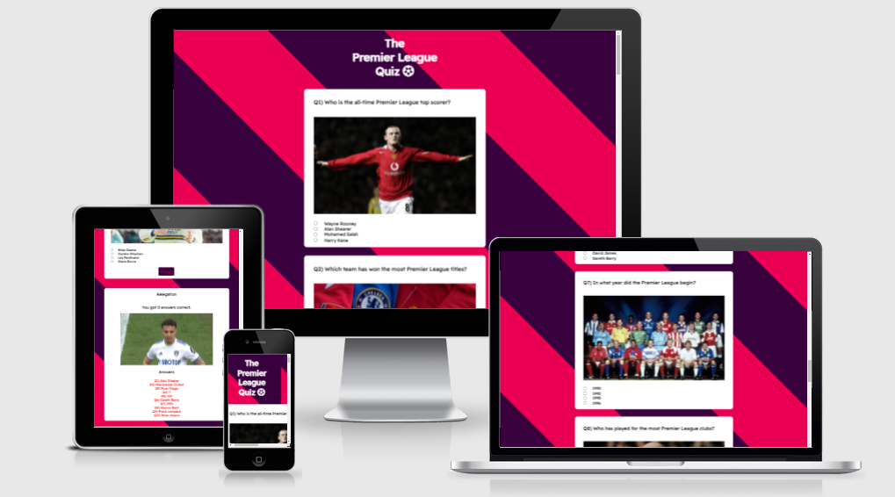
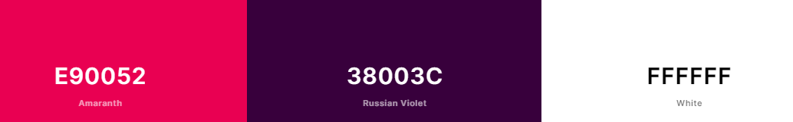
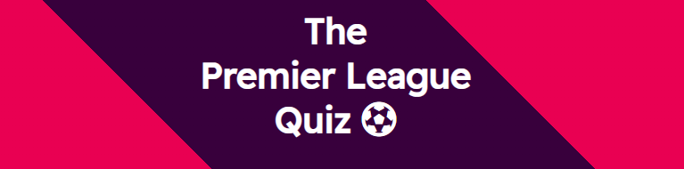
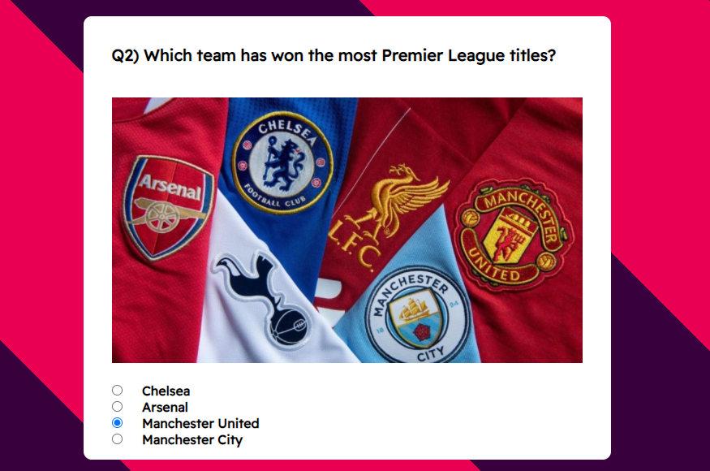
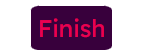
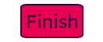
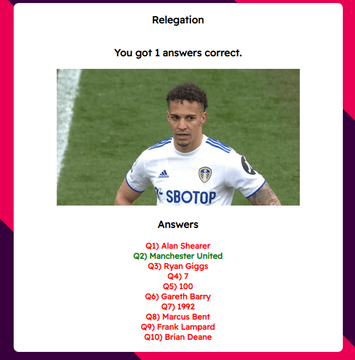

# **_Premier Leage Quiz_**

The premier League quiz is a quiz I made for people who share my passion for football, and the Premier League in particular. The quiz is easy to use and fun.

Welcome to the process behind <a href="https://joeyo991.github.io/premierleague-quiz/" target="_blank" rel="noopener">The Premier League Quiz</a>

# User Experience

## Site Structure

The Premier League Quiz website is a single page with a quiz in the shape of a form for the user to complete.

## Design Choices

 * ### Typography
     The chosen font for the page was 'Readex Pro'. This font was chosen because it is easy to read, it is stylish, and because it is very similar to the official Premier League font.

 * ### Colour Scheme
     The colour scheme chosen for the page was based on the Official Premier League colour scheme for the 2021/2022 season. It features white, a pink (Amaranth) and a purple (Russian Violet).

# Features

The Premier League Quiz is set up to be striking and easy on the eyes. It is immediately recognizable to football fans because of the colours and fonts used throughout.

## Existing Features
  * ### Header
    
    * Situated at the top of the webpage is the header. The text and colours let the user know immediately what this page is about.
    * The football icon is there for style and suits the page well.

  * ### The Quiz

      * The quiz is made up of 10 questions with varying difficulty, depending on the user's knowledge of the Premier League.
      * Each question has 4 possible asnwers in the form of radio buttons. This means only one of the choices can be picked.
      * Each question also has a corresponding image that may or may not be a clue to the answer.

  * ### Finish Button
      * This button is clicked when the user has finished the quiz.
      * The button is styled with the colours of the background.
      * When it is hovered over, the colours flip and there is a border around it.
      * This button is what tells the JavaScript function to execute.

  * ### Quiz Results
      * The quiz results become visible when the finish button is pressed.
      * If the user gets between 0-3, a sad gif and the word 'Relegation' appear.
      * If the user gets between 4-6, a less sad gif and the phrase 'mid-table' appear.
      * If the user gets between 7-9, a happy gif and the phrase 'top-four' appear.
      * If the user gets all 10, an ecstatic gif and the word 'Champion' appear.
      * The phrases are football terms and the gif corresponds to each term.
      * The correct asnwers are also shown, with the ones the user got right appearing in green and the ones they didn't in red.

