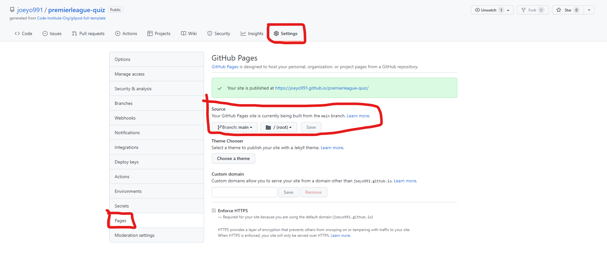
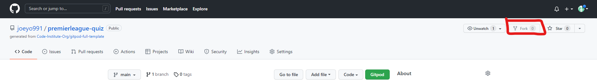

# **_Premier Leage Quiz_**

The premier League quiz is a quiz I made for people who share my passion for football, and the Premier League in particular. The quiz is easy to use and fun.

Welcome to the process behind <a href="https://joeyo991.github.io/premierleague-quiz/" target="_blank" rel="noopener">The Premier League Quiz</a>

# User Experience

## Site Structure

The Premier League Quiz website is a single page with a quiz in the shape of a form for the user to complete.

## Design Choices

 * ### Typography
     The chosen font for the page was 'Readex Pro'. This font was chosen because it is easy to read, it is stylish, and because it is very similar to the official Premier League font.

 * ### Colour Scheme
     The colour scheme chosen for the page was based on the Official Premier League colour scheme for the 2021/2022 season. It features white, a pink (Amaranth) and a purple (Russian Violet).

# Features

The Premier League Quiz is set up to be striking and easy on the eyes. It is immediately recognizable to football fans because of the colours and fonts used throughout.

## Existing Features
  * ### Header
    
    * Situated at the top of the webpage is the header. The text and colours let the user know immediately what this page is about.
    * The football icon is there for style and suits the page well.

  * ### The Quiz

      * The quiz is made up of 10 questions with varying difficulty, depending on the user's knowledge of the Premier League.
      * Each question has 4 possible asnwers in the form of radio buttons. This means only one of the choices can be picked.
      * Each question also has a corresponding image that may or may not be a clue to the answer.

  * ### Finish Button
      * This button is clicked when the user has finished the quiz.
      * The button is styled with the colours of the background.
      * When it is hovered over, the colours flip and there is a border around it.
      * This button is what tells the JavaScript function to execute.

  * ### Quiz Results
      * The quiz results become visible when the finish button is pressed.
      * If the user gets between 0-3, a sad gif and the word 'Relegation' appear.
      * If the user gets between 4-6, a less sad gif and the phrase 'mid-table' appear.
      * If the user gets between 7-9, a happy gif and the phrase 'top-four' appear.
      * If the user gets all 10, an ecstatic gif and the word 'Champion' appear.
      * The phrases are football terms and the gif corresponds to each term.
      * The correct asnwers are also shown, with the ones the user got right appearing in green and the ones they didn't in red.

## Future Features

* More Quizzes
  * In the future this page could have a lot more than one quiz.
* Share Results
  * If i were to deploy this site for real in the future I would give the user the option to share their results.
* Timer
  * I could also add a timer to give the user only a limited time to complete the quiz, like many quiz sites have.

# Technologies Used

* [HTML5](https://html.spec.whatwg.org/) - provides the content and structure for the website.
* [CSS](https://www.w3.org/Style/CSS/Overview.en.html) - provides the styling.
* [JavaScript](https://developer.mozilla.org/en-US/docs/Web/JavaScript) - provides interactivity.
* [Gitpod](https://www.gitpod.io/#get-started) - used to deploy the website.
* [Github](https://github.com/) - used to host and edit the website.

# Testing

## Code Validation
The Premier League Quiz site has been tested thoroughly. All the code has been run through the [W3C HTML Validator](https://validator.w3.org/), the [W3C CSS Validator](https://jigsaw.w3.org/css-validator/) and the [JSHint JavaScript Validator](https://jshint.com/).

### HTML
There was no errors in my HTML code.

### CSS
There was no errors in my CSS code.

### JavaScript
There were no errors in my JavaScript code, only warnings about declaring variables with the 'let' keyword and using template literals. I found that these warnings had no effect on my page in testing.

## Responsiveness Test
The responsivess design tests were carried out with [Google Chrome Dev Tools](https://developer.chrome.com/docs/devtools/) and a [Responsive Design Checker](http://ami.responsivedesign.is/#)

## Device Testing
The Premier League Quiz site was tested and works on the following devices:
* Moto G4
* Galaxy S5
* iPhone 5 / SE
* iPhone 6/7/8 (Plus)
* iPad / iPad Pro
* Displays < 1200px
* Displays > 1200px

The page fully renders, all images render, there were no broken links, it was fully responsive and the scripts run smoothly.

## Browser Testing
The Premier League Quiz site was tested and works on the following web browsers:
* Google Chrome
* Microsoft Edge
* Mozilla Firefox
* Safari

The site fully renders, all images render, there were no broken links, it was fully responsive and the scripts run smoothly.

## Bugs
There were no bugs when validating any of my code. Any potential bugs, errors or mistakes were found and fixed while in the writing process.

## Additional Testing
The site was also tested using [Google Lighthouse](https://developers.google.com/web/tools/lighthouse) in Chrome Developer Tools to test each of the pages for:

* Performance - How the page performs while loading.
* Accessibility - How accessible is the site.
* Best Practices - The site conforms to industry best practices.
* SEO - Search Engine Optimisation. Is the site optimised for search engine result rankings.

The results for the Premier League Quiz site are below:

# Deployment

## To deploy the project

The site was deployed to GitHub Pages. The steps to deploy a site are as follows:

1. In the GitHub repository, navigate to the **Settings** tab.
2. In Settings, navigate to the **Pages** tab on the left side.
3. Under **Source**, select the branch to main / master, then click save.
4. Once the main branch has been selected, the page will automatically refresh and indicate that the deployment was successful.

The live link to the GitHub repository is - https://github.com/joeyo991/premierleague-quiz

## To fork the repository on GitHub

A copy of the GitHub Repository can be made by forking the GitHub account. This copy can be viewed and changes can be made to the copy without affecting the original repository. Take the following steps to fork the repository:

1. Log into **GitHub** and locate the [repository](https://github.com/joeyo991/premierleague-quiz).
2. On the right hand side of the page inline with the repository name is a button called **Fork**, click on the button to create a copy of the original repository in your GitHub account.

## To create a local clone of this project
The method for cloning a project is below:

1. Under the repository's name, click on the **code** tab.
2. In the **Clone with HTTPS** section, click on the icon next to the URL to copy it.

3. In your IDE of choice, open **Git Bash**.
4. Change the current working directory to the location where you want the cloned directory to be made.
5. Type **git clone**, and then paste the URL copied from GitHub.
6. Press **enter** and the local clone will be created.

# Credits

### Content
* The fonts came from [Google Fonts](https://fonts.google.com/).
* The icons came from [Font Awesome](https://fontawesome.com/).
* Some of the code used was from [YouTube Tutorial](https://www.youtube.com/watch?v=C7NsIRhoWuE) I found very helpful.

### Media
* The images on this site were found on [Google Images](https://www.google.com/imghp?hl=en).
* The gifs on this site were found on [Giphy](https://giphy.com/).

# Acknowledgements

